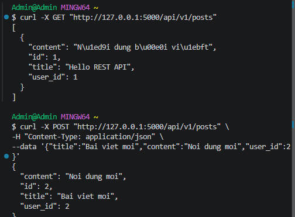

## 1 Resources
Có 4 Resources chính:
+ user
+ post
+ comments
+ tags

## 2 Collection / Item / Sub-resource

Collection:
+ GET  /api/v1/users 
+ GET  /api/v1/posts
+ GET  /api/v1/tags

Item:
+ GET    /api/v1/users/{userId}
+ GET    /api/v1/posts/{postId}
+ GET    /api/v1/tags/{tagId}

Sub-resource:
+ GET /api/v1/posts/{postId}/comments
+ GET /api/v1/posts/{postId}/tags

## 3. Cây endpoint và version

Version API sử dụng `v1`.

``` text
/api/v1
│
├── /users
│   └── /{userId}
│
├── /posts
│   └── /{postId}
│       ├── /comments
│       └── /tags
│
└── /tags
    └── /{tagId}
```

## 4. Triển khai cho collection /posts


- Get trả danh sách bài viết
- Post tạo bài viết