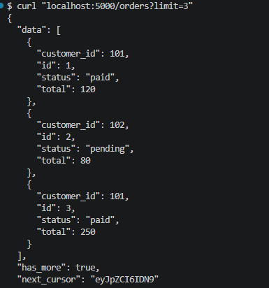
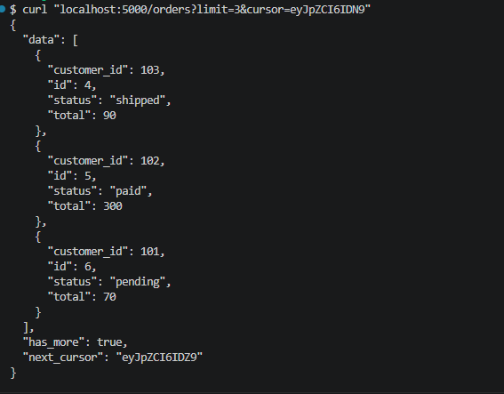
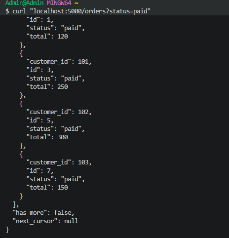
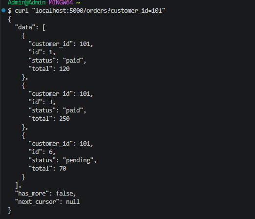
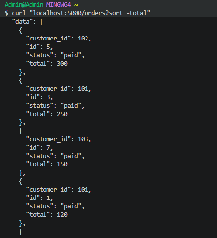
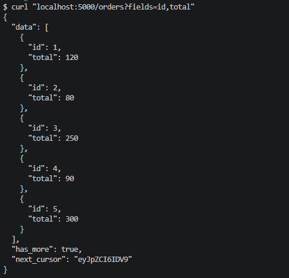
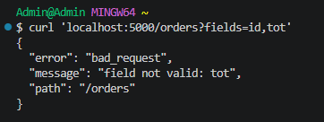

## Triển khai /orders có cursor pagination
# (1) cursor; 
Lấy chỉ 3 dữ liệu

Lẩy tiếp 3 dữ liệu sau id = 3

# (2) filter: status, customer_id; 
Lấy theo status

Lây theo cus_id

# (3) sort; 
Sort theo total từ lớn tới bé

# (4) sparse fieldsets
Lấy dữ liệu cỉ cần trả về id và total

# (5) 400 BAD REQUEST
